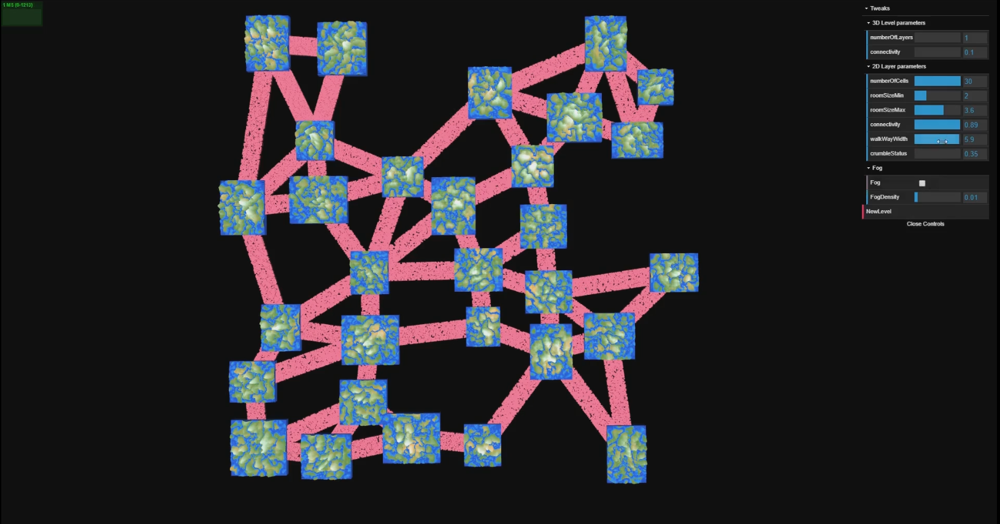
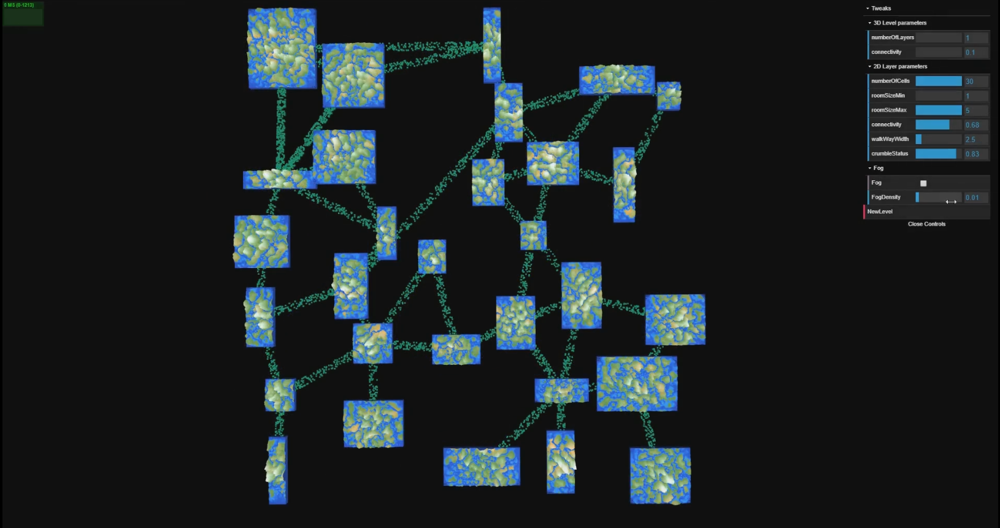

# Interesting Level Generator

## Overview

The 'Interesting Level Generator' is a procedural multi-layer dungeon generator that generates levels based on a dynamically generated voronoi like graph after it has been heavily modified by various filters. Realistic fog, crumbling pathways, and terrain are added over the basic level layout to give it a unique mysterious foreign world aesthetic.

### Original Design Goals

- Procedural 3D game level ( multiple stacks of 2D maps ).
- Implicit surfaces to create terrain on the resulting map floors
- Custom fog shader

The specifications below will be implemented if I have enough time in the final week:
- Controllable Player character
- Collision handling so player can’t walk through geometry.

## Techniques Used
### 2D Maps Level Generation:
#### Room Generation:

  - Using sampling and rejection to layout the slabs in a given space.
  - Then use a fake voronoi generation technique to create a graph. The fake voronoi technique consists of first starting with 3 connected nodes, and then for every new node you want to add to the graph you find the 2 closest neighbours from the existing graph and form edges between them.
  - We can improve the above technique a bit more by sorting the positions of the slabs along one axis. This makes the connections look more like a voronoi pattern.
  - This graph is highly connected so we randomly remove connections.
  - The graph can end up with intersecting edges in a few edge cases, so we carry out 2D line intersection tests and remove any intersections if they exist.

#### Walkways between slabs:

  - Because of the graph we created above we have edge and node data, in other words we know which points to connect. So between any 2 points we could lay out corridors(planes) to connect them, but this is boring.
  - Instead we can use instancing to place many many tiny cubes along the line segment and then randomly remove cubes to make it look like a crumbling walkway.
  - We also need to give the walkway some width so we take the cross product of the direction of the line segment and the y axis (up) to get a horizontal ortho-normal direction for width. Add instanced cubes not just on the line segment but for a certain width for each line segment.

### 3D Level Generation:
  We can create multiple 2D maps at different heights.

#### Interlevel Connecting Paths:

- This is a similar problem to the one we solved in “Walkway between slabs” section; But now it’s in 3D.
- For every layer we pick a random node/slab as the starting point of our path between layers.
- For the end point of that line segment we search through the nodes in the layer above for rooms that are beyond a certain distance from the randomly picked starting node (so paths don’t go straight up and there is more complexity in connections), and form a list of these “toNodes”.
- Pick a random “toNode”, and using the random starting node we have a 3D line segment.
- Create a similar instancing cubes setup for these paths as we did with the walkways.
- Remove random lines, and also carry out 3D intersection tests and remove any intersecting paths, if they exist.

#### Path shifting for Paths:

- To make the paths connecting walkways seem more organic and prevent janky looking paths that start at the center of each cell and end at the center of the other one ( this is a problem as a player can never go to a higher layer, they will be stuck underneath the “toNode” ).
- We need to shift paths to the edges of the cells they are connecting. Simply offset by the width and length in the correct direction.
- To add organic paths we should shift by both the width and length.

#### Fog:

- Created in the shader, with global control of density, color, and a on/off switch.
- A good approximation of fog fall-off is: e-(fogDensity2 x distance2)
- Fog also appears to have different densities at the periphery of our vision, so we need to account for rimColor.
- Resource: http://in2gpu.com/2014/07/22/create-fog-shader/

#### Terrain:

- Terrain was created in the shader.
- Create an elevation map and a moisture map using smoothed 2D noise with different seed values (or different noise functions).
- Use the elevation map to deform vertices in the shader.
- Create a moisture map ( similar to the elevation map ).
- Use the float values from the elevation and moisture as uv values to determine colors from gradients.

#### Grid based Acceleration:
- Takes too much memory, and so was never used for anything.

## Future Work
- kD tree acceleration Structure for Collision Handling
- Character with basic character controls
- Collision handling for the character
- Trampolines to fill up empty and negative space

## Resources
- Terrain: http://www.redblobgames.com/maps/terrain-from-noise/
- Fog: http://in2gpu.com/2014/07/22/create-fog-shader/

## Moar Images!!

